## Regression
### Simple Linear Regression
#### model 
$t=f(x)=w_0 +w_1x$
* $w_0$ and $w_1$ are parameters of the model. $w_0$ allow you to move the line up and down.
*  $w_1$ change the slope of the line.
#### loss function
$L_n = (t_n - f(x_n;w_0;w_1))^2$  

Average loss function $L = \frac{1}{N}\sum_{n=1}^N{(t_n - f(x_n;w_0;w_1))}^2$

#### Gradient Descent 梯度下降
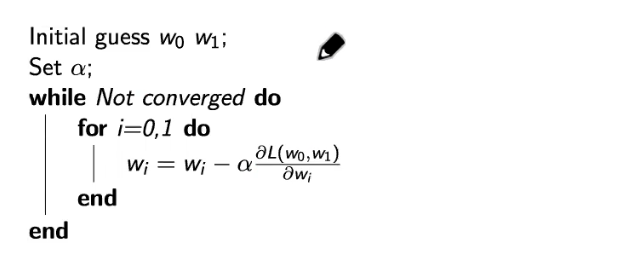  

Trying to find gradient of our average square loss.  $\frac{\partial L(w_0,w_1)}{\partial w_0}$  and $\frac{\partial L(w_0,w_1)}{\partial w_1}$  
we're tring to do is to decrease the gradient to find a strategy that allow us to push to find the combinations in $w_0$ and $w_1$ that allow us to push the greed both greetings to 0.  $\alpha$ is the learning rate.

我们要做的就是降低梯度，找到一种策略，让我们能够推动找到 $w_0$ 和 $w_1$ 中的组合，让我们能够把贪婪的两个问候都推到 0。

#### Fit the model with the Least Square solution. 

Let's fit a model with an analytical solution to the problem of finding the parameters with the minimum average loss. 

Recall that the average loss is 
$$  L(w_0, w_1) = \frac{1}{N}\sum_{n=1}^N (t_n - w_0 - w_1x_n)^2 $$
$L$ is a function of $w_0$ and $w_1$. All $x_n$ and $t_n$ are given.  

The procedure to find the analytical expression of the optimal parameters is the following:

`xbar = sum(x)/len(x)`  
`tbar = sum(y)/len(y)`  
`xxbar = np.sum(np.dot(x,x))/len(x)`  
`xtbar = np.sum(np.dot(x,y))/len(x)`  
`w1 = (xbar * tbar - xtbar) / (xbar * xbar - xxbar)`  
`w0 = tbar - w1 * xbar`

### Polynomial Regression
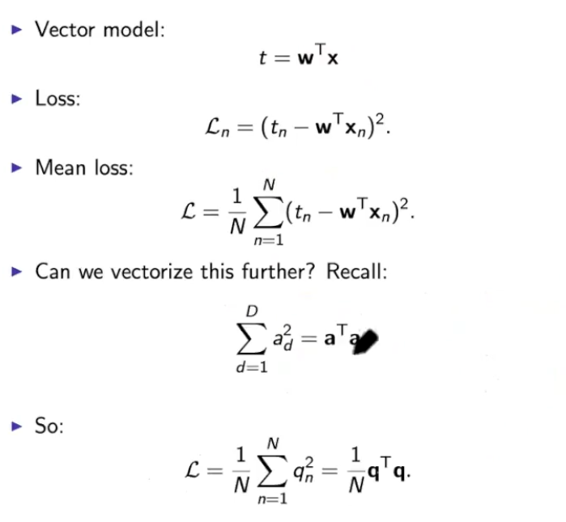
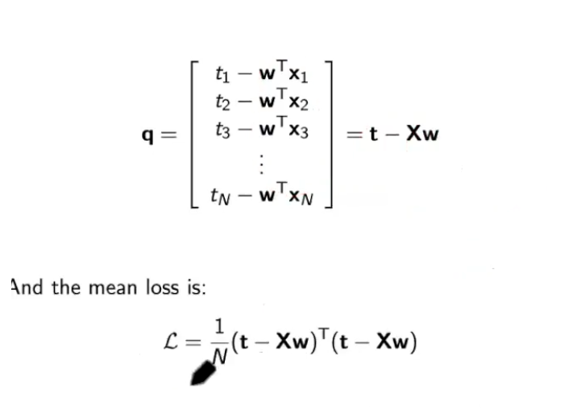  

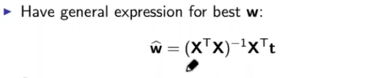
#### Polynomial Regression Example
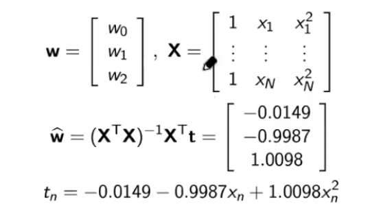

##### 优点（Advantages）
* 简单易懂（Simplicity）:多项式模型因其简单性而易于理解和实现，特别适合基础的统计分析和预测模型。
* 灵活性（Flexibility）:通过增加多项式的阶数，可以使模型更灵活，从而能够适应更复杂的数据模式。
* 广泛的适用性（Wide Applicability）:多项式拟合可以应用于许多类型的数据，包括时间序列、空间数据等。
* 解析解的可用性（Availability of Analytical Solutions）:对于多项式回归，往往可以找到解析解，这在某些情况下比数值方法更可靠。
* 光滑的曲线（Smooth Curves）:多项式产生的曲线是光滑的，对于插值和趋势分析很有用。

##### 缺点（Disadvantages）
*过拟合风险（Risk of Overfitting）:高阶多项式容易导致过拟合，特别是在数据点较少时。
* 外推不可靠（Unreliability in Extrapolation）:多项式模型对于数据范围之外的预测（外推）往往不可靠。
* 计算问题（Computational Issues）:随着阶数的增加，多项式模型的计算可能变得复杂，尤其是在大数据集上。
* 局部数据敏感性（Sensitivity to Local Data）:多项式拟合对局部数据非常敏感，一小部分数据的变化可能导致整体模型的大幅度变动。
* 非线性关系建模困难（Difficulty in Modeling Non-linear Relationships）:尽管增加阶数可以提高模型的灵活性，但多项式模型在捕捉复杂非线性关系方面仍有局限。
 
 ### Common basis functions
 * Polynomial
 * Radial basis function(RBF) 
 * Sigmoid function  
 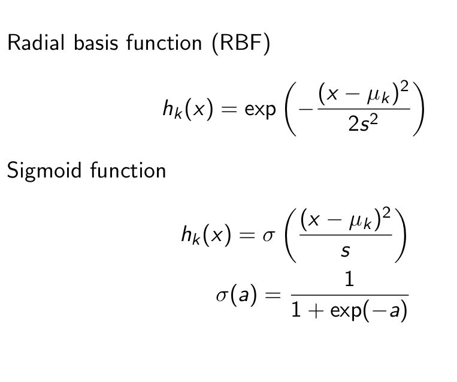

在多项式拟合的环境中，RBF（径向基函数）和Sigmoid函数的使用略有不同，它们不像在机器学习模型中那样直接作为激活或核函数。在这种情况下，这两个函数的角色更多的是提供一种替代的函数形式，以增强多项式拟合的能力。以下是它们在多项式拟合中的作用：

#### RBF（径向基函数）:
在多项式拟合中，RBF可以用作一种特殊的基函数。与传统的多项式基（如x, x², x³等）不同，RBF基函数关注数据点与某个中心点的距离。
使用RBF可以帮助在复杂数据集上进行更灵活的拟合。特别是当数据表现出局部性质时（例如，在某些区域有不同的趋势），RBF能够更好地捕捉这些特征。The use of RBF can help in more flexible fitting on complex datasets. Especially when the data exhibits localised properties (e.g. different trends in certain regions), RBF can better capture these features.

##### 优点（Advantages）
* 灵活性（Flexibility）: RBF的参数（如中心和宽度）提供了高度的灵活性，允许模型在不同尺度上捕捉数据特征。
* 非线性能力（Non-linear Capability）: RBF的参数可以调整以捕获复杂的非线性关系，这在标准多项式回归中可能难以实现。
* Flexibility: The parameters of RBF (e.g., centre and width) provide a high degree of flexibility, allowing the model to capture data features at different scales.
* Non-linear Capability: The parameters of RBF can be tuned to capture complex non-linear relationships, which may be difficult to achieve in standard polynomial regression.

##### 缺点（Disadvantages）
* 参数选择困难（Difficult Parameter Selection）: 正确选择RBF的参数（例如，中心点的数量和位置）可能非常具有挑战性，需要细致的调优。
* 过拟合风险（Risk of Overfitting）: 如果参数选择不当，RBF容易导致过拟合，特别是在数据点较少的情况下。
* Difficult Parameter Selection: Correctly selecting the parameters of an RBF (e.g., number and location of centroids) can be very challenging and requires careful tuning.
* Risk of Overfitting: If the parameters are not chosen correctly, RBF is prone to overfitting, especially when there are fewer data points.
##### 解决方法
Use less centers or add small value to the diagonal of X^TX, using regularization [2].   
使用lesscenters 或在 X^TX 对角线上添加小值，使用正则化[2]。

#### Sigmoid函数:
Sigmoid函数在纯粹的多项式拟合中不常见。然而，如果在某些上下文中使用，它可以提供一种平滑的、有界的非线性形式。
在某些特定情况下，比如需要限制输出范围时，Sigmoid函数可能被用于变换数据，使其适合用多项式方法进行拟合。In some specific cases, such as when there is a need to limit the output range, the Sigmoid function may be used to transform the data to make it suitable for fitting by polynomial methods.

在多项式拟合中，通常重点在于选择合适的多项式阶数以避免过拟合或欠拟合。RBF和Sigmoid函数在这个过程中可能不是主流选择，但它们可以在特定情况下提供有价值的替代方案，特别是在处理非线性复杂数据时。

##### 优点（Advantages）
* 少量参数（Fewer Parameters）: Sigmoid函数通常只有斜率和阈值两个参数，这使得调整和优化比RBF简单。
* 输出范围限制（Limited Output Range）: Sigmoid的参数确保了输出值在一定范围内，有利于某些特定类型的回归问题。
* Fewer Parameters: Sigmoid functions usually have only two parameters, slope and threshold, which makes tuning and optimisation simpler than RBF.
* Limited Output Range: Sigmoid parameters ensure that the output values are within a certain range, which is beneficial for certain types of regression problems.
##### 缺点（Disadvantages）
* 较弱的非线性表达（Weaker Non-linear Expression）: 相比于RBF，Sigmoid函数在表达复杂的非线性关系方面可能较为受限，尤其是在只有少量参数可调整的情况下。
* 梯度问题（Gradient Issues）: Sigmoid函数在两端饱和时梯度趋近于零，这可能导致在梯度下降过程中更新缓慢，尽管这在多项式回归中可能不那么显著。
* Weaker Non-linear Expression: Compared to RBF, the Sigmoid function may be more limited in expressing complex non-linear relationships, especially when there are only a few parameters to adjust.
* Gradient Issues: Sigmoid functions saturate at both ends with gradients approaching zero, which can lead to slow updates during gradient descent, although this may not be as significant in polynomial regression.
##### 解决方法
* 批量归一化（Batch Normalization）: 这种技术可以在网络的每一层对输入进行规范化处理，使其更接近零均值，从而有助于缓解非零中心化问题。
* 学习率调整: 使用自适应学习率算法，如Adam或RMSprop，可以在训练过程中自动调整学习率，从而缓解由于梯度消失导致的学习缓慢问题。
* Batch Normalization: This technique helps mitigate the non-zero centrality problem by normalising the inputs at each layer of the network so that they are closer to the zero mean.
* Learning Rate Adjustment: Using an adaptive learning rate algorithm, such as Adam or RMSprop, the learning rate can be automatically adjusted during training to mitigate slow learning due to vanishing gradients.

#### CV Cross-Validation 交叉验证
交叉验证（Cross-validation）是一种统计方法，用于评估机器学习模型在独立数据集上的性能。它主要用于防止模型过拟合，确保模型具有良好的泛化能力。  
Cross-validation is a statistical method used to evaluate the performance of machine learning models on independent datasets. It is primarily used to prevent model overfitting and ensure good generalization capability of the model.

在交叉验证过程中，数据集被分为几个部分。在这些部分中，一部分被用作训练数据，而另一部分被用作测试数据。这个过程重复进行多次，每次选择不同的部分作为测试集，其余部分作为训练集。最后，这些测试结果被平均或以其他方式合并，以估计模型的整体性能。  
During the cross-validation process, the dataset is divided into several parts. In these parts, some are used as training data while others are used as test data. This process is repeated multiple times, each time choosing a different part as the test set and the rest as the training set. Finally, these test results are averaged or combined in other ways to estimate the overall performance of the model.

常见的交叉验证方法包括k折交叉验证（k-fold cross-validation），其中数据集被分为k个大小相等的子集；以及留一交叉验证（leave-one-out cross-validation），适用于小数据集，每次留下一个数据点作为测试集。  
Common cross-validation methods include k-fold cross-validation, where the dataset is divided into k equal-sized subsets, and leave-one-out cross-validation, which is suitable for small datasets, leaving out one data point at a time as the test set.

#### Bayes rule
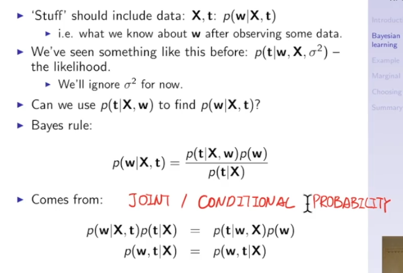
* Posterior density: $p(w|X,t)$
* likelihood: $p(t|X,w)$
* Prior density:$p(w)$
* Marginal likelihood:$p(t|X)$ 

* Figure 2A: Lasso [1], the fitted line misses many data points between 1990-2010,suggesting some weights of basis functions using these centres are pushed to zero[1]. Out of the three fitting methods, only Lasso with strong regularization can dothis [1].

* Figure 2B: Ridge regression [1]: the model ignores some extreme data points on theleft [1], suggesting weights controlling the corresponding basis functions are verysmall [1].

* Figure 2C: Linear regression [1]: the model fits most of the data points very well,especially fitting the data points between 1950 and 1970 perfectly [1], suggesting alarge number of basis functions actively contribute to the fitted model [1].

* Figure 2A: Ridge regression [1]: the model ignores many densely populated data points on the left and points that could lead to bigger bends, suggesting weights controlling the corresponding basis functions are very small [1].
* Figure 2B: Linear regression [1]: the model fits the densely populated data points on the left and the rest of the data very well, especially fits the two data points on the very right perfectly, suggesting large number of basis functions actively contribute the fitted model [1].
* Figure 2C: Lasso [1], the fitted line is straight line parallel to the x-axis, suggesting all weights of the basis functions are zero. Out of the three fitting method, only lasso with very strong regularization can do this [1].

## Classification
### 回归问题和分类问题的区别与联系 
In regression, the target variable is a continuous/real-valued variable [1]. In classification, the target variable is a discrete/binary/categorical variable [1]. To obtain a classification problem from regression, one can cluster/group the continuous/real-valued variable into groups [1].

在回归中，目标变量是连续/实值变量 [1]。在分类中，目标变量是离散/二元/分类变量[1]。要从回归中获得分类问题，可以将连续/实值变量聚类/分组 [1]。

### KNN
#### Nearest Neighbour
Simple idea: Label a new sample the same as its closest data
point
#### K choice
##### 过小的K值
* 过拟合（Overfitting）：一个很小的K值（如K=1或K=2）会使模型对训练数据中的噪声过度敏感，容易造成过拟合。A very small value of K (e.g., K=1 or K=2) can make the model overly sensitive to noise in the training data and can easily cause overfitting.
* 高度敏感（High Sensitivity）：模型对于离群点（outliers）和噪声数据非常敏感。The model is very sensitive to outliers and noisy data.
##### 优点:
* 捕捉复杂度（Capturing Complexity）：小的K值能够捕捉数据中的复杂模式，对局部模式敏感。small K values capture complex patterns in the data and are sensitive to local patterns.
* 决策边界（Decision Boundary）：小的K值会产生更复杂的决策边界，理论上可以更好地适应训练数据。a small K value produces more complex decision boundaries, which theoretically can be better adapted to the training data.
##### 缺点:
* 泛化能力差（Poor Generalization）：容易受到数据集中随机噪声的影响，导致泛化能力差。susceptibility to random noise in the dataset, leading to poor generalisation.
* 计算成本（Computational Cost）：如果使用懒惰学习方法，每次分类时都需要重新计算，这可能导致在预测时计算量较大。it needs to be recalculated every time the classification is made, which may lead to a large amount of computation in prediction.
##### 过大的K值
* 欠拟合（Underfitting）：一个很大的K值会导致模型不能充分捕捉数据的特征，容易造成欠拟合。A very large K value can result in a model that does not adequately capture the features of the data and is prone to underfitting.
* 稳健性（Robustness）：较大的K值可以减少噪声数据的影响，因为分类是基于较大邻域的多数投票。A larger value of K reduces the effect of noisy data because classification is based on majority voting in larger neighbourhoods.
##### 优点:
* 平滑决策边界（Smooth Decision Boundary）：大的K值会产生更平滑的决策边界，这通常意味着更好的泛化能力。Large K values produce smoother decision boundaries, which usually means better generalisation.
* 抗噪声（Noise Resistance）：对异常值和噪声具有更好的抵抗力。Better resistance to outliers and noise.
##### 缺点:
* 边界区域混淆（Boundary Confusion）：较大的K值可能导致模型对边界区域的类别划分不清晰。larger values of K may result in the model not classifying the categories of the boundary regions clearly.
* 计算成本（Computational Cost）：在大数据集上计算距离成本高，尤其是当K值很大时。Calculating distances on large datasets is costly, especially when the value of K is large.
#### compute the distance between samples

### Logistic regression
We use an activation function to make the classifier more robust to the
outliers：
$$y(x) = \sigma(w_0+w^Tx) ~~~~~~ x\gets[1,x]^T ~~ w\gets[w_0,w]^T$$
$$\sigma(z) = \frac{1}{1+e^{-z}}$$
$$y(x) = \sigma(w^Tx) = \frac{1}{1+e^{-w^Tx}}$$

**Logistic regression** outputs can be interpreted as posterior
class probabilities: $$P(t=1|x,w) = y(x) = \sigma(w^Tx) = \frac{1}{1+e^{-w^Tx}}$$
$$P(t=0|x,w) = 1 - P(t=1|x,w) $$

**Likelihood** for individual label:
$$p(t_i=1|x_i,w) = \sigma(w^Tx_i)$$
$$p(t_i=0|x_i,w) = 1 - \sigma(w^Tx_i)$$
Combining:
$$L(x,w) = \prod{p(t_i=1|x_i,w)p(t_i=0|x_i,w)}$$ 
$$L(x,w) = \prod_{i=0}{[\sigma(w^Tx_i)^{t_i}][1-\sigma(w^Tx_i)^{1-t_i}]}$$ 
**log-likelihood**:
$$logL(x,w) = t_ilog[\sigma(w^Tx_i)] + (1-t_i)log[1-\sigma(w^Tx_i)]$$

**Cost function**:
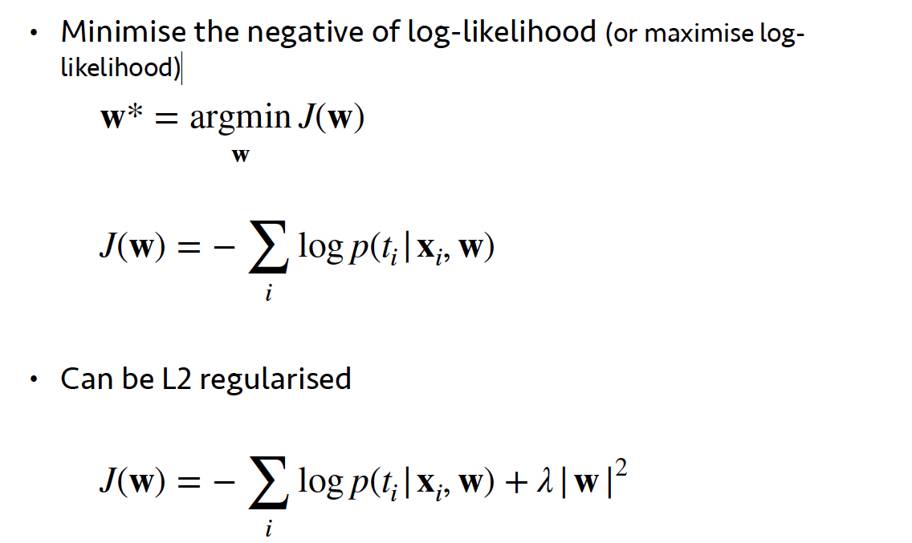  

#### 多分类问题 Multi-classification problems 
ovr：把一类作为正例，其他全部作为反例  
ovr: treat one class as positive examples and all others as negative examples
#### 特征共线性 feature covariance
* 1.完美收敛的情况下不影响结果 perfect convergence does not affect results
* 2.影响模型的可解释性 affects model interpretability
* 3.耗时提升，有限次可能会导致无法收敛 time-consuming enhancement, finite times may lead to failure to converge
#### L1、L2正则化问题 L1, L2 regularisation problem
L1、L2正则化都可以使用，都能够提高模型泛化性能。Both L1 and L2 regularisation can be used and both can improve the model generalisation performance.

#### 验证指标 evluation
##### Sensitivity Specificity
敏感度衡量的是模型识别实际正类样本的能力。Sensitivity measures the ability of the model to identify actual positive class samples.
$$S_e = \frac{TP}{TP+FN}$$
特异性衡量的是模型识别实际负类样本的能力。Specificity measures the ability of the model to recognise actual negative class samples.
$$S_p = \frac{TN}{TN+FP}$$
##### ROC
敏感度（Sensitivity）和特异性（Specificity）是评估分类模型性能的重要指标，它们分别衡量了模型识别正类和负类的能力。准确度（Accuracy）则是模型正确预测的总体比例。虽然这些指标很有用，但它们各自都有局限性，特别是在处理不平衡数据集时。这就是为什么提出接收者操作特征曲线（ROC）和曲线下面积（AUC）的原因。  

Sensitivity and Specificity are important metrics for assessing the performance of a classification model, and they measure the model's ability to identify positive and negative classes, respectively. Accuracy, on the other hand, is the overall percentage of correct predictions made by the model. While these metrics are useful, they each have limitations, especially when dealing with unbalanced datasets. This is why the receiver operating characteristic curve (ROC) and area under the curve (AUC) are proposed.
##### Advantage
* 1. 综合性能评估（Comprehensive Performance Evaluation）
ROC曲线通过同时考虑敏感度和1-特异性（即假正率）为不同的阈值提供了一个图形化的性能展示。这让我们能够一眼看到模型在不同决策阈值下的整体表现。The ROC curve provides a graphical presentation of the performance for different thresholds by considering both sensitivity and 1-specificity (i.e., false positive rate). This allows us to see at a glance the overall performance of the model at different decision thresholds.

* 2. 阈值选择（Threshold Selection）
它显示了在不同阈值下敏感度和特异性的权衡，帮助我们选择最适合特定应用的阈值。It shows the trade-off between sensitivity and specificity at different thresholds, helping us to choose the most appropriate threshold for a particular application.

* 3. 不平衡数据的性能表现（Performance on Imbalanced Data）
在不平衡数据集中，准确度可能会产生误导，因为模型可能仅仅通过预测多数类来获得高准确度。ROC曲线提供了一种区分模型性能的更好方式，因为它独立于类别分布。In unbalanced datasets, accuracy can be misleading because the model may achieve high accuracy simply by predicting a majority of classes.The ROC curve provides a better way of distinguishing the performance of the model because it is independent of the class distribution.

* 4. 比较不同模型（Comparing Different Models）
通过比较不同模型的AUC，我们可以简单地判断哪个模型的整体性能更好，而不依赖于具体的分类阈值。By comparing the AUC of different models, we can simply determine which model performs better overall, independent of the specific classification threshold.  
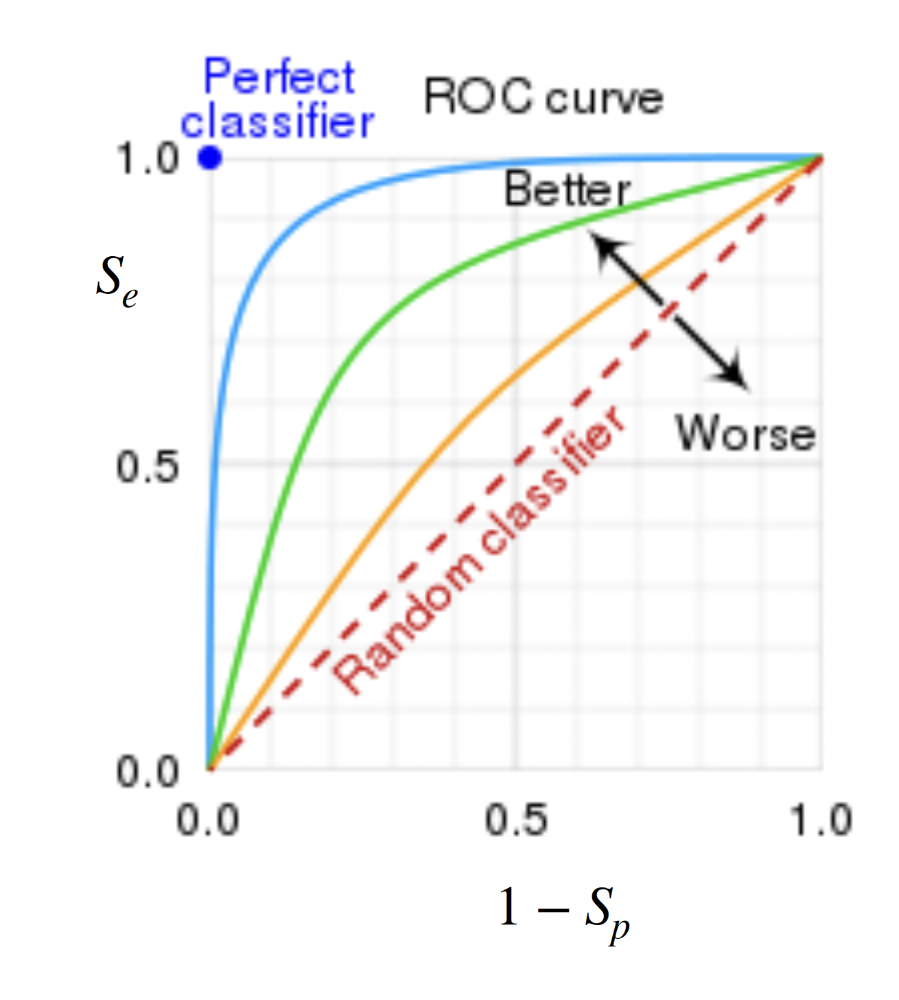  

##### F1 Score
F1分数是精确度（Precision）和召回率（Recall）的调和平均值，它被提出是为了在这两个指标之间提供一个平衡。当我们需要同时考虑精确度和召回率时，F1分数是一个有用的指标。
$$F1 = 2 \times \frac{S_p \times S_e}{S_p + S_e} = \frac{2}{S_e^{-1}+S_p^{-1}}$$
F1分数的提出主要是因为在某些情况下，只关注精确度或召回率是不够的。例如，在一个不平衡的数据集中，一个模型可能通过简单地预测多数类来获得高精确度，但这个模型对于少数类的预测可能很差。同样地，一个模型可能有很高的召回率，因为它几乎将所有样本都标记为正类，但这会导致很多负类样本被错误分类。F1分数通过组合这两个指标，给出了一个更全面的模型性能评价。

The F1 score is the reconciled average of Precision and Recall, and it is proposed to provide a balance between these two metrics. The F1 score is a useful metric when we need to consider both Precision and Recall.

The F1 score is proposed mainly because in some cases, focusing only on precision or recall is not enough. For example, in an unbalanced dataset, a model may have high precision by simply predicting the majority class, but the model may be a poor predictor of the minority class. Similarly, a model may have high recall because it labels almost all samples as positive classes, but this can lead to many negative class samples being misclassified.The F1 score gives a more comprehensive evaluation of model performance by combining these two metrics.

### SVM
支持向量机（SVM）是一种在机器学习和统计分类领域广泛使用的监督学习模型。它旨在通过找到一个最佳超平面来分类不同的数据点。SVM的核心思想是尽可能地在类别之间创建最大的边缘。这个超平面的目的是分割不同的类别，并尽可能增大与每个类别中最近的数据点（即支持向量）之间的距离。  

Support Vector Machine (SVM) is a supervised learning model widely used in the field of machine learning and statistical classification. It aims to classify different data points by finding an optimal hyperplane.The core idea of SVM is to create the largest possible edges between categories. The purpose of this hyperplane is to segment the different categories and increase the distance to the nearest data point (i.e., support vector) in each category as much as possible.

#### 定义
* 训练数据及标签 
$$(X_1,y_1),(X_2,y_2)...(X_N,X_N) ~~~ X=\begin{bmatrix} x_{11}\\x_{12}\\ \vdots \\x_{1m} \end{bmatrix}$$ 

* 线性模型 
$$(w,b) ~~~ W^T+b=0 ~~~~ W=\begin{bmatrix} w_{1}\\w_{2}\\ \vdots \\w_{m} \end{bmatrix}$$
* 训练集线性可分 ${(x_i,y_i)}_{i=1\sim N} $
$$\exist(w,b), 使：任意的i=1\sim N$$ 
$$有 若y_i=1，则W^TX_i + b \ge 0 $$
$$若y_i=-1，则W^TX_i + b < 0$$

* 若 $y_i = [-1,1]$ 则可以写为 $y_i[W^TX_i + b] \ge 0$

#### 两个事实

#### 转化为优化问题
* 最小化(minimize): $\left \| W \right \| ^ 2$
* 限制条件 $y_i[W^TX_i + b] \ge 1 ~~~~ (i=1 \sim N)$

#### SVM处理非线性
* 最小化(minimize): 
* $$ \frac{1}{2} \left \| W \right \| ^ 2 + C \sum_{i=1}^N \xi_i ~~~~~~ $$ 
* 其中 $ \sum_{i=1}^N \xi_i$ 是正则项(Regulation)  
 $ \xi_i$ 是松弛变量(Slack Variable) 

* 限制条件 $y_i[W^T\phi(x_i) + b] \ge 1-\xi_i ~~~~ (i=1 \sim N) ~~~ \xi_i \ge 0$

#### 向高维推进 用有限维度
我们可以不知道无限维映射$\phi(x)$的显式表达，但我们只需要知道一个核函数(kernel function) 
$$K(x_1,x_2) = \phi(x_1)^T \phi(x_2)$$
则上述的限制条件依旧可解

#### 核函数
* 高斯核 $K(x_1,x_2) = e^{-\frac{\left \| x_1 - x_2 \right \| ^ 2}{2\sigma^2}} = \phi(x_1)^T \phi(x_2)$

* 多项式核 $K(x_1,x_2) = {(x_1^Tx_2)}^d = \phi(x_1)^T \phi(x_2)$

* sigmod核 $K(x_1,x_2) = tanh(\beta x_1^Tx_2 + \theta)= \phi(x_1)^T \phi(x_2) ~~~~ \beta>0 , ~~ \theta < 0$

#### 引入KKT和对偶问题
* 处理约束优化问题：SVM的优化问题是一个有约束的优化问题。这意味着我们不仅要找到最优解，还要满足一定的约束条件。KKT条件提供了一种强大的方法来处理这类有约束的优化问题，它结合了拉格朗日乘子法和满足约束条件的必要条件。

* 简化问题求解：原始的SVM优化问题是一个凸二次规划问题，直接求解可能在计算上非常复杂，尤其是在特征维数较高时。通过转换为对偶问题，我们可以将原始问题转换为一个更易于求解的形式。对偶问题通常有更少的变量，特别是在处理大规模数据集时，这种转换可以显著减少计算成本。

* Handling constrained optimisation problems: The optimisation problem of SVM is a constrained optimisation problem. This means that not only do we have to find the optimal solution, but we also have to satisfy certain constraints. the KKT condition provides a powerful way to deal with this type of constrained optimisation problem, combining the Lagrange multiplier method with the necessary conditions to satisfy the constraints.

* Simplified problem solving: the original SVM optimisation problem is a convex quadratic programming problem, which can be computationally complex to solve directly, especially when the feature dimensions are high. By converting to a dyadic problem, we can transform the original problem into a more tractable form. Dyadic problems typically have fewer variables, especially when dealing with large-scale datasets, and this conversion can significantly reduce the computational cost.

引入kkt条件后整个表达为 
$$\\L(w,b,\alpha) =  \frac{1}{2} \left \| w \right \| ^ 2 + \sum_i^N \alpha_i (1 - y_i(w^Tx_i + b)) \\ \alpha_i>0 \alpha=(\alpha_1 ... \alpha_n)^T ~~~~\\ (1 - y_i(w^Tx_i + b)) \le 0  \\ \alpha_i (1 - y_i(w^Tx_i + b))=0 $$

线性求解：

对偶问题：
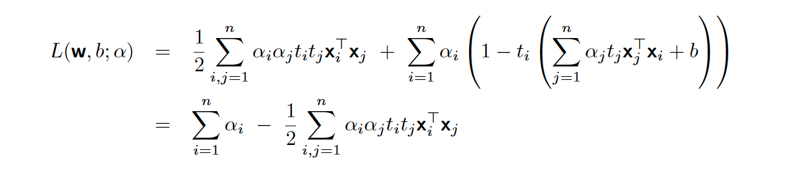
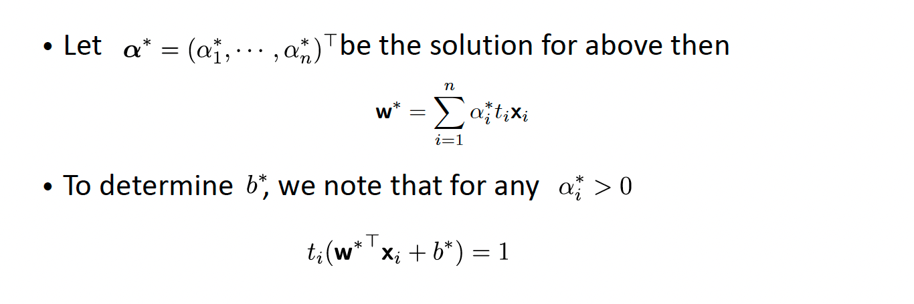
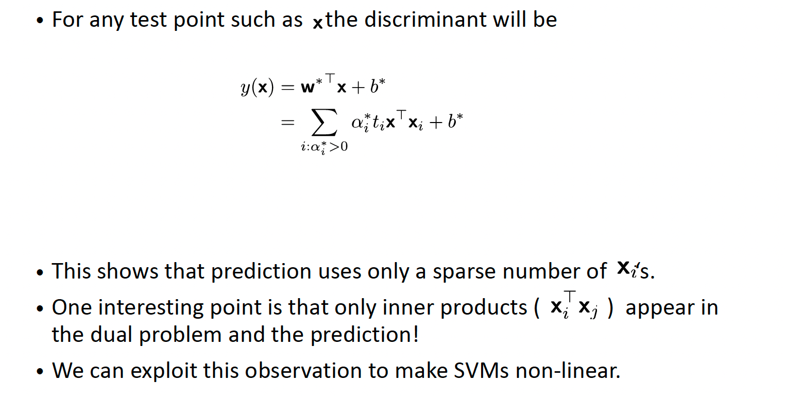
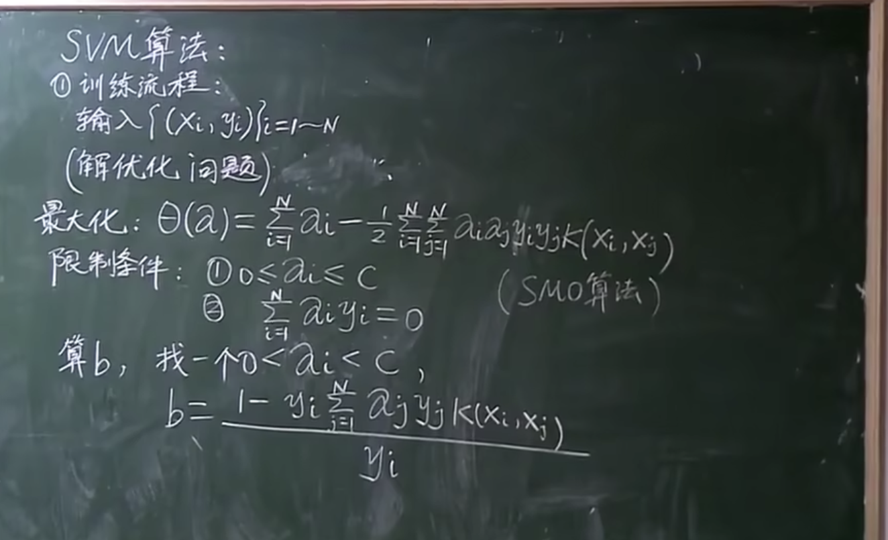

## Clustering
### K-means
K-means是一种广泛使用的聚类算法，其目的是将数据点分组成K个集群。该算法简单且易于实现，适用于各种数据聚类问题。
#### 优点
* 简单高效：算法结构简单，易于理解和实现，对于大型数据集也相对高效。Simple and efficient: the algorithm structure is simple, easy to understand and implement, and relatively efficient for large data sets.
* 适用性：适用于各种类型的聚类问题，尤其是数据维度较低、数据集较大的场景。Applicability: suitable for various types of clustering problems, especially for scenarios with low data dimensions and large datasets.

#### 缺点
* 簇的数量K需要预先指定 The number of clusters, K, needs to be pre-specified
* 对初始簇中心敏感：K-means的结果高度依赖于初始质心的选择。不同的初始质心可能导致完全不同的聚类结果。Sensitive to initial cluster centres: the results of K-means are highly dependent on the choice of initial centre of mass. Different initial centre of mass may lead to completely different clustering results.
* 对异常值敏感：异常值或噪声可能对簇的质心计算产生显著影响。Sensitive to outliers: Outliers or noise may have a significant impact on the calculation of the centre of mass of the clusters, thus affecting the overall clustering results.
* 只适用于球形簇：K-means假设簇是球形的，对于非球形的或大小极不相同的簇，效果不佳。Only works with spherical clusters: K-means assumes that the clusters are spherical and does not work well with non-spherical clusters or clusters of very different sizes.
* 难以处理不同密度的簇：如果数据集中的簇具有非常不同的密度，K-means可能无法正确地区分它们。Difficult to handle clusters with different densities: if the clusters in a dataset have very different densities, K-means may not be able to distinguish them correctly.
* 固定的簇分配：每个点都被严格分配到一个簇中，这忽略了可能存在的数据点属于多个簇的情况。Fixed cluster assignments: each point is strictly assigned to a cluster, which ignores possible cases where data points belong to multiple clusters.

#### Defines
- Assume that there are K clusters.
- Each cluster is defined by a position in the input space: 
- $$\mu_k=[\mu_{k1},\mu_{k2}]^T$$
- Each $x_n$ is assigned to its closest cluster
- Distance is normally Euclidean distance:
- $$d_{nk} = (x_n - \mu_k)^T(x_n - \mu_k)$$

#### how do we find $\mu_k$
- Gusse  $\mu_1,\mu_2,...,\mu_k$
- assign each x_n to its closest $\mu_k$
- $Z_{nk}=1 if $x_n$ assigned to $\mu_k$ (0 otherwise)
$Z_{nk}$是一个指示器变量表示数据点$x_n$是否被分配到特定的簇$k$。如果$x_n$被分配到簇 k，则$Z_{nk}$ ​的值为 1；如果没有被分配到簇 k，则其值为 0。
- Update $\mu_k$ to average of $x_ns$ assgined to $\mu_k$
- $$\mu_k = \frac{\sum_{n=1}^{N} Z_{nk} x_n}{\sum_{n=1}^{N} Z_{nk}}$$

分子$\sum_{n=1}^{N} Z_{nk} x_n$ 这部分计算的是簇k中所有数据点$x_n$的加权和。由于$Z_{nk}$要么是 0 要么是 1，所以只有当$x_n$属于簇k 时，它才会被加入到和中。  

分母$\sum_{n=1}^{N} Z_{nk}$这部分计算的是簇k中数据点的数量。将分子除以分母，我们得到的$\mu_k$​是簇k 中所有点的坐标的平均值，即新的簇中心。这样做是为了将簇中心移动到其所代表的所有点的中心位置，从而在下一次迭代中更好地代表这个簇。

#### 带入kernel的K-means

在K-means算法中，使用核函数（Kernel）是对算法的一种扩展，使其能够进行非线性聚类。这种方法通常被称为“Kernel K-means”。它利用核技巧映射数据到一个高维特征空间，以便在这个空间中执行线性聚类，同时实际上并不需要显式地计算映射后的数据点。这允许算法找到原始输入空间中的非线性边界。In the K-means algorithm, the use of a kernel is an extension of the algorithm to allow for nonlinear clustering. This method is often referred to as "Kernel K-means". It uses the kernel trick to map the data to a high-dimensional feature space in order to perform linear clustering in this space, without actually having to explicitly compute the mapped data points. This allows the algorithm to find nonlinear boundaries in the original input space.

Kernel K-means的工作原理是用核函数代替原始数据点之间的欧氏距离计算。核函数可以测量原始输入空间中数据点之间的相似度。最常用的核函数包括多项式核、径向基函数（RBF或高斯核）和Sigmoid核。Kernel K-means works by replacing the calculation of Euclidean distances between the original data points with a kernel function. The kernel function measures the similarity between data points in the original input space. The most commonly used kernel functions include polynomial kernel, radial basis function (RBF or Gaussian kernel) and Sigmoid kernel.

在Kernel K-means中，我们不直接计算新的簇中心k，因为在映射后的高维空间中直接计算质心可能是不切实际的。相反，我们使用核函数来间接评估点之间的关系。这种方法的一个挑战是更新步骤不再像简单的K-means那样直观，因为我们不能简单地计算映射后的点的均值。In Kernel K-means, we do not directly compute the new cluster centre k, as it may be impractical to compute the centre of mass directly in the mapped high-dimensional space. Instead, we use the kernel function to indirectly evaluate the relationship between points. A challenge with this approach is that the update step is no longer as intuitive as in simple K-means, since we cannot simply compute the mean of the mapped points.

##### 推导
$$d_{nk} = (x_n - \mu_k)^T(x_n - \mu_k) ~~~~~~~~ \mu_k = \frac{\sum_{n=1}^{N} Z_{nk} x_n}{\sum_{n=1}^{N} Z_{nk}} ~~~ N_k = \sum_n Z_{nk}$$
展开:
$$x_n^T x_n - \frac{2}{N_k} \sum_{m=1}^{N} z_{mk} x_m^T x_n + \frac{1}{N_k^2} \sum_{m,l=1}^{N} z_{mk} z_{lk} x_m^T x_l$$
使用$k(x_n,x_n)$代替$x_n$
$$
k(x_n, x_n) - \frac{2}{N_k} \sum_{m=1}^{N} z_{mk} k(x_n, x_m) + \frac{1}{N_k^2} \sum_{m,l=1}^{N} z_{mk} z_{lk} k(x_m, x_l)
$$

##### 优点：
- 非线性聚类能力：通过使用核函数，Kernel K-means可以在高维特征空间中进行聚类，能够识别出原始空间中的非线性可分的数据结构。Non-linear clustering capability: by using kernel functions, Kernel K-means can perform clustering in high-dimensional feature spaces and is able to identify non-linearly divisible data structures in the original space.
- 灵活性：核方法的引入增加了算法处理复杂数据的能力，可以通过选择不同的核函数来调整算法的聚类行为。Flexibility: The introduction of the kernel method increases the ability of the algorithm to handle complex data, and the clustering behaviour of the algorithm can be adjusted by choosing different kernel functions.
- 扩展性：Kernel K-means能够扩展传统K-means，使其能够处理在传统算法中无法有效解决的问题。Extensibility: Kernel K-means is able to extend traditional K-means, allowing it to handle problems that cannot be solved efficiently in traditional algorithms.
##### 缺点：
- 选择核函数：核函数的选择对聚类结果有很大影响，但并没有一种通用的方法来确定哪个核函数是最佳的，这需要用户根据具体问题来调整和尝试。Choice of kernel function: the choice of kernel function has a great impact on the clustering results, but there is no general method to determine which kernel function is the best, which needs to be adapted and tried by the user according to the specific problem.
- 计算开销：在高维特征空间中计算核矩阵可能非常耗时，尤其是当数据集很大时，这会大大增加计算成本。Computational overhead: Computing the kernel matrix in a high dimensional feature space can be very time-consuming, especially when the dataset is large, which can greatly increase the computational cost.
- 理解难度：由于特征空间的维度可能非常高（甚至是无穷维），因此很难直观理解聚类结果和簇的形状。Difficulty of understanding: Since the dimension of the feature space can be very high (even infinite), it is difficult to intuitively understand the clustering results and the shape of the clusters.
- 参数调整：除了核函数的选择，还需要调整其他参数（如在RBF核中的γ），这需要通过交叉验证等方法来优化。Parameter tuning: in addition to the choice of kernel function, other parameters need to be tuned (e.g., γ in the RBF kernel), which needs to be optimised by methods such as cross-validation.
##### 改进方法：
- 自动选择核函数：可以使用网格搜索和交叉验证的方法来自动化核函数和参数的选择过程。Automated kernel function selection: the process of kernel function and parameter selection can be automated using grid search and cross-validation methods.
- 降低计算复杂性：使用随机采样或者近似算法来减少核矩阵的大小，从而降低计算成本。Reduce computational complexity: use random sampling or approximation algorithms to reduce the size of the kernel matrix, thus reducing the computational cost.
- 增加可解释性：引入降维技术，如主成分分析（PCA）或t-SNE，来可视化高维聚类结果，增加聚类过程的透明度和可解释性。Increase Interpretability: Introduce dimensionality reduction techniques, such as Principal Component Analysis (PCA) or t-SNE, to visualise high-dimensional clustering results, increasing the transparency and interpretability of the clustering process.
- 优化算法实现：利用并行计算和分布式计算技术来优化Kernel K-means的计算效率。 Optimisation of algorithm implementation: Parallel and distributed computing techniques are used to optimise the computational efficiency of Kernel K-means.
- 后处理：对聚类结果进行后处理，如聚类后修剪或合并类似簇，以提高聚类质量和实用性。Post-processing: post-processing the clustering results, such as pruning or merging similar clusters after clustering, to improve the quality and usefulness of clustering.

### GMM Gaussina Mixture Model
#### Probability Density Function of Gaussian Distribution
$$f(X) = \frac{1}{\sigma \sqrt{2\pi}} e ^{-\frac{1}{2} (\frac{X-\mu}{\sigma})^2} ~~~ p(X|\mu,\sigma)～N(\mu,\sigma)$$
另一种表达形式：
$$p(\mathbf{x} | \mu, \Sigma) = \frac{1}{(2\pi)^{n/2}|\Sigma|^{1/2}} e^{-\frac{1}{2}(\mathbf{x}-\mu)^T \Sigma^{-1} (\mathbf{x}-\mu)}$$
- $p(\mathbf{x} | \mu, \Sigma)$这是条件概率密度函数，表示数据点x, 在给定均值 
$\mu$和协方差$\Sigma$条件下的概率密度。
- $\mu$这是高斯分布的均值向量
- $\Sigma$
- n : 这表示数据点 x 的维度。
- $(2\pi)^{n/2}$ 这是分布的归一化常数的一部分，使得整个概率分布积分为1。
- $|\Sigma|^{1/2}$ 这是协方差矩阵的行列式的平方根，也是归一化常数的一部分。
- $e^{-\frac{1}{2}(\mathbf{x}-\mu)^T \Sigma^{-1} (\mathbf{x}-\mu)}$这是指数函数，反映了 x 相对于均值 μ 的偏离程度。

#### 几何角度
几何角度：加权平均（多个高斯分布叠加而成）$\alpha_k$ 权重=概率值
$$p(x) = \sum_{k=1}^K \alpha_k N(x|\mu_k,\Sigma_k), ~~ \sum_{k_n}^k\alpha_k = 1$$

#### 混合模型
x: observed variable   
z: latent variable 隐变量 对于的样本x是属于哪一个高斯分布； 离散的随机变量；
$\begin{array}{cccc}
z& C_1 & C_2 & \cdots & C_K \\
\hline
p(\theta) & p_1 & p_2 & \cdots & p_k \\
\end{array}$ $~~~~~~~~\sum_{k=1}^{K} p_k = 1$
$$p(x) = \sum_{k=1}^k p_k N(x|\mu_k,\Sigma_k)$$

X：observed data  $X = (x_1,x_2,...,x_n)$  
(X,Z):complete data   
$\theta = {p_1,p_2,...,p_k,~ \mu_1,\mu_2,...,\mu_k ~ \Sigma_1,\Sigma_2,...,\Sigma_k}$  
极大似然估计:
$$\^{\theta}_{MLE} = \argmax_{\theta} \log P(X) = \argmax \sum_{i=1}^N\log P(x_i)$$

直接用极大似然估计无法求出解析解，所以引入了EM算法。  

EM算法主要有两个步骤：E步（Expectation step）和M步（Maximization step）
E步：根据当前参数的估计值来计算潜在变量的期望值。对于GMM来说，这涉及到计算每个数据点属于每个高斯分布的概率这一步是通过$p(z_i = C_k |x_i, \theta^{(t)})$来进行的。

M步：根据E步中计算出的期望来更新参数的估计值。对于GMM，这包括更新每个高斯分布的均值、协方差矩阵和混合权重。这是通过最大化$Q(\theta,\theta^{(t)})$函数来实现的。

EM:
$$p(x,z) = p(z)p(x|z) = p_z N(x|\mu_z,\Sigma_z) $$ 
$$p(z|x) = \frac{p(x,z)}{p(x)} = \frac{p_z N(x|\mu_z,\Sigma_z)}{\sum_{k=1}^k p_k N(x|\mu_k,\Sigma_k)}$$
$$Q(\theta,\theta^{(t)}) = \sum_{i=1}^N\sum_{z_i}\log p(x_i,z_i|\theta)p(z_i｜x_i,\theta^{(t)}) \\ 
=  \sum_{i=1}^N\sum_{z_i}\log p_z N(x|\mu_z,\Sigma_z) \frac{p_z^{(t)} N(x|\mu_z^{(t)},\Sigma_z^{(t)})}{\sum_{k=1}^k p_k^{(t)} N(x|\mu_k^{(t)},\Sigma_k^{(t)})}$$ 
$$=\sum_{k=1}^K \sum_{i=1}^N [\log p_k + \log N(x_i|\mu_k,\Sigma_k)] p(z_i = C_k |x_i, \theta^{(t)})$$

求$p_k^{(t+1)}$:
$$p_k^{(t+1)}  = \argmax_{p_k} \sum_{k=1}^K \sum_{i=1}^N [\log p_k + \log N(x_i|\mu_k,\Sigma_k)] p(z_i = C_k |x_i, \theta^{(t)}) ~~~ S.t. \sum_{k=1}^K p_k = 1$$

#### 优点
- 灵活性：GMM可以适应多种形状的簇，因为每个组分的高斯分布有其自己的均值和协方差。
- 软聚类：GMM提供了软聚类的能力，即它可以给出数据点属于各个簇的概率，而不是硬性地划分。
- 概率框架：GMM提供了一个自然的概率框架，用于数据点的生成模型，这有助于进行统计推断。
- 可解释性：模型参数有明确的统计意义（如均值表示簇的中心，协方差表示簇的形状和方向）。
- Flexibility: GMM can accommodate clusters of many shapes, as each component's Gaussian distribution has its own mean and covariance.
- Soft clustering: GMM provides the ability for soft clustering, i.e., it can give the probability that a data point belongs to each cluster, rather than a hard division.
- Probabilistic framework: GMM provides a natural probabilistic framework for generative modelling of data points, which helps in making statistical inferences.
- Interpretability: the model parameters have a clear statistical meaning (e.g. the mean indicates the centre of the cluster, the covariance indicates the shape and direction of the cluster).

#### 缺点
- 参数选择：需要事先确定组分的数量，这在不了解数据结构的情况下可能很困难。
- 局限性：尽管每个组分可以是椭圆形，但GMM通常不适用于识别非凸形或复杂形状的簇。
- 初始化敏感：GMM的结果对初始化参数很敏感，可能导致局部最优解。
- 计算开销：GMM在大数据集上可能非常计算密集，特别是当组分数目较多时。
- 奇异性问题：当数据点精确地（或几乎）落在高维空间中的较低维子空间时，协方差矩阵可能变得奇异或接近奇异，使得模型估计变得不稳定。
- Parameter selection: the number of components needs to be determined in advance, which can be difficult without knowing the structure of the data.
- Limitations: although each component can be elliptical, GMM is usually not suitable for identifying non-convex or complex shaped clusters.
- Initialisation sensitivity: GMM results are sensitive to initialisation parameters, which may lead to locally optimal solutions.
- Computational overhead: GMM can be very computationally intensive on large data sets, especially when the number of components is high.
- Singularity problem: when the data points fall exactly (or almost) in a lower-dimensional subspace in a high-dimensional space, the covariance matrix may become singular or nearly singular, making the model estimation unstable.

#### 改进方法
- 模型选择：使用交叉验证来选择最佳的组分数量。
- 正则化：对协方差矩阵进行正则化以避免奇异性问题。
- Model selection: use cross-validation to select the optimal number of components.
- Regularisation: regularise the covariance matrix to avoid singularity problems.

