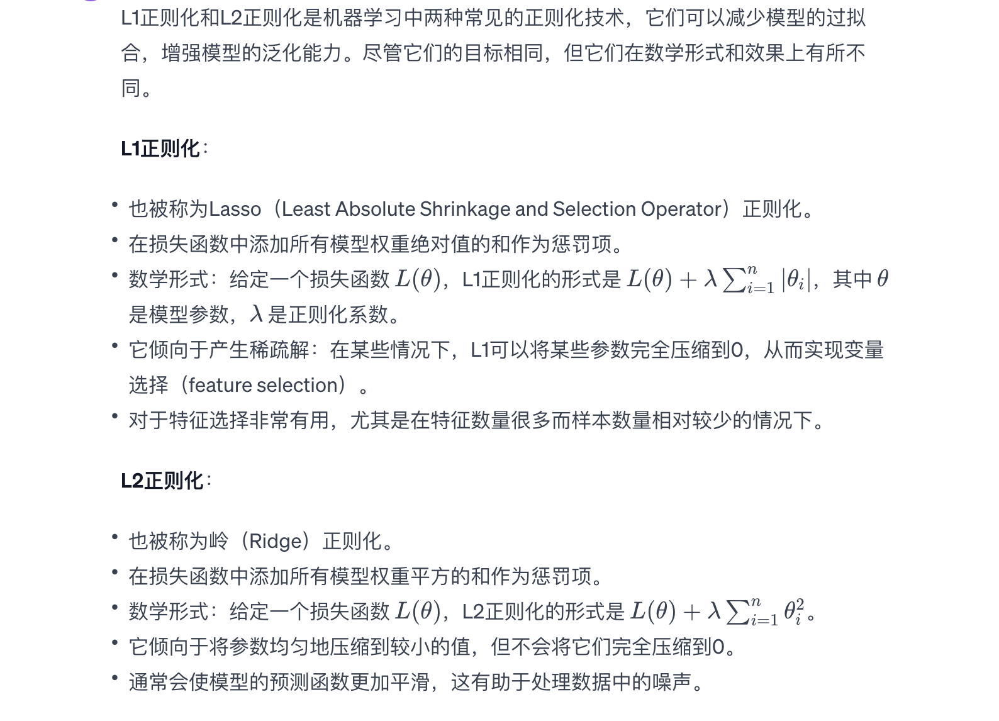
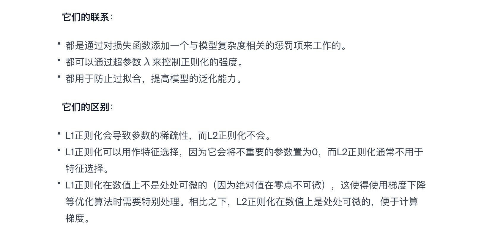

 

### Clustering
#### K-means：
##### 长处：
* 计算效率高：K-means因其算法简单而计算上相对快速。Computationally efficient: k-means is computationally relatively fast due to the simplicity of its algorithm.
* 易于理解和实现：算法步骤直观，容易理解。Easy to understand and implement: the steps of the algorithm are intuitive and easy to understand.
* 可以很好地处理大型数据集。Can handle large datasets well.

##### 不足：
* 假设簇是凸形的和同质的，因此对于不规则或大小差异大的簇效果不佳。Assumes that clusters are convex and homogeneous, so it does not work well for clusters that are irregular or have large differences in size.
* 对噪声和离群值敏感。Sensitive to noise and outliers.
* 必须事先指定簇的数量，这在实际应用中可能不是那么直观。The number of clusters must be specified in advance, which may not be intuitive in practical applications.
* 由于局部最优的问题，对初始中心点的选择敏感。Sensitive to the choice of initial centroids due to local optima.

#### Kernel-Kmeans：
##### 长处：
* 可以识别非线性可分的簇：通过使用核技巧映射到高维空间，在这个空间中可以将非线性问题转化为线性问题。Can recognise non-linearly divisible clusters: by using the kernel trick maps to a high-dimensional space where non-linear problems can be transformed into linear ones.
* 更适用于处理复杂形状的簇。More suitable for dealing with complex shaped clusters.
#### 不足：
* 计算代价高：尤其是在需要处理大规模数据集时。Computationally expensive: especially when large-scale datasets need to be processed.
* 同样需要预先指定簇的数量。Also need to pre-specify the number of clusters.
* 核函数的选择和参数调整可能比较困难，需要根据具体数据进行调整。Selection of kernel functions and tuning of parameters may be difficult and need to be adapted to specific data.

#### 高斯混合模型（GMM）：
##### 长处：
* 软聚类方法：提供了每个点对簇的概率归属，不是硬边界分配。Soft clustering approach: provides probabilistic attribution of each point to a cluster, not hard boundary assignment.
* 灵活性高：可以拟合任意形状的簇。Highly flexible: can fit clusters of arbitrary shape.
* 可以对数据分布做出模型化的假设（例如，每个簇由一个高斯分布来描述）。Can make modelling assumptions about the data distribution (e.g. each cluster is described by a Gaussian distribution).
##### 不足：
* 对于高维数据，参数估计可能变得困难和计算量大。For high-dimensional data, parameter estimation can become difficult and computationally intensive.
* 也需要预先指定簇的数量，the number of clusters also needs to be pre-specified.
* 可能受到初始参数选择的影响。May be affected by initial parameter selection.

#### 处理棘手问题
* 高度不均匀密度的簇：如果数据集中存在着密度差异极大的簇，这些方法都可能无法正确地区分簇。
* 高度复杂的簇结构：对于具有复杂拓扑结构或者不规则形状的簇，传统的聚类方法可能难以识别。
* 大量噪声和离群点：所有这些方法在面对大量的噪声和离群点时都可能失效，因为它们都对异常值敏感，这些异常值可以扭曲聚类的中心或者分布参数。
* 聚类结构未知：当不知道数据中是否真的存在明显的聚类结构时，这些方法可能都会强加一个结构，即使数据实际上是均匀分布的。
* 簇的数量未知：这些方法通常需要预先指定簇的数量，如果不知道有多少个簇，就很难选择正确的参数设置。
* 特征空间中的关联性：如果数据的特征之间存在复杂的关联性，这些基于距离或概率分布的聚类方法可能无法捕捉这种关联性。
* 时间序列数据：对于时间序列数据，如果没有适当地考虑时间依赖性，这些聚类方法可能无法工作。

#### Dealing with Tricky Problems
* Highly inhomogeneous density clusters: if there are clusters in the dataset with very different densities, none of these methods may be able to distinguish clusters correctly.
* Highly complex cluster structures: clusters with complex topologies or irregular shapes may be difficult to recognise by traditional clustering methods.
* Large amount of noise and outliers: all these methods may fail when confronted with a large amount of noise and outliers, as they are all sensitive to outliers that can distort the centre of the cluster or the distribution parameters.
* Cluster structure unknown: when it is not known whether there is actually an obvious cluster structure in the data, all of these methods may impose one, even if the data is actually uniformly distributed.
* Number of clusters unknown: these methods usually require the number of clusters to be pre-specified, making it difficult to choose the correct parameter settings if it is not known how many clusters there are.
* Correlation in feature space: if there is a complex correlation between the features of the data, these clustering methods based on distance or probability distribution may not be able to capture this correlation.
* Time-series data: for time-series data, these clustering methods may not work if time dependencies are not properly accounted for.

#### 2020 3.（C）
K均值：三个聚类中心垂直分布 [1]。初始聚类中心也可能是垂直分布的，也有可能是其他聚类中心[1]。聚类数量的交叉验证可能更倾向于聚类数量大于 3 [1]。

图(B)展示了高斯混合模型的聚类结果。GMM是一种概率模型，它不仅考虑了数据点到簇中心的距离，还考虑了簇的形状和大小。GMM同样需要预先设定簇的数量，但是与K-means不同，GMM还要估计每个簇的协方差结构，这使得它能够识别出扁平或拉长的簇。GMM的参数估计通常通过期望最大化（EM）算法完成。图(B)中，GMM似乎更精确地刻画了数据点的概率分布，允许簇具有不同的形状和方向。

Figure (B) illustrates the clustering results of Gaussian mixture model.GMM is a probabilistic model that takes into account not only the distance of the data points to the centre of the clusters, but also the shape and size of the clusters.GMM also requires the number of clusters to be predetermined, but unlike K-means, GMM also estimates the covariance structure of each cluster, which makes it possible to identify flattened or elongated clusters.Parameter estimation in GMM is usually done through the Expectation Maximisation (EM) algorithm.

### L1 L2正则化
L2正则化，是一种用于防止机器学习模型过拟合的技术。在多项式拟合中，过拟合通常表现为模型对训练数据中的噪声或离群值过于敏感，导致模型在新数据上的泛化能力下降。L2正则化通过对模型参数的大小加以限制来缓解这一问题。

L2正则化的工作原理如下：

惩罚大的参数值：在损失函数中加入一个与模型参数平方和成比例的项。这个正则化项会惩罚模型参数的大值，因此模型会倾向于选择更小的参数值。Penalising large parameter values: a term proportional to the sum of the squares of the model parameters is added to the loss function. This regularisation term penalises large values of the model parameters, so the model will tend to choose smaller parameter values.

收缩效应：正则化项迫使模型参数向零收缩，这减少了模型的复杂度。在多项式拟合中，降低了高阶项的系数，从而减少了模型对数据中小变动的敏感性。Shrinkage effect: the regularisation term forces the model parameters to shrink towards zero, which reduces the complexity of the model. In polynomial fitting, the coefficients of the higher order terms are reduced, which reduces the sensitivity of the model to small changes in the data.

平滑预测函数：减小参数值使得模型的预测函数更加平滑，因此对于离群点和噪声不会产生剧烈的波动。Smooth prediction function: Reducing the parameter values makes the model's prediction function smoother, so it does not fluctuate drastically for outliers and noise.

增强泛化能力：通过防止过分拟合训练数据中的特殊点（比如离群值），L2正则化增加了模型的泛化能力，从而在未知数据上表现更好。Enhanced generalisation: By preventing overfitting to particular points in the training data (e.g. outliers), L2 regularisation increases the model's generalisation ability, resulting in better performance on unknown data.

在实际应用中，正则化的强度由一个超参数控制，该超参数需要通过交叉验证等方法来确定。

#### 区别与联系

#### They are linked:
* Both work by adding a penalty term to the loss function that is related to the complexity of the model.
* Both can be passed the hyperparameter λ to control the strength of the regularisation.
* Both are used to prevent overfitting and improve the generalisation of the model.
#### Their difference:

* L1 regularisation leads to sparsity of parameters, whereas L2 regularisation does not.
* L1 regularisation can be used as feature selection as it sets unimportant parameters to 0, whereas L2 regularisation is not usually used for feature selection.
* L1 regularisation is not numerically trivial everywhere (because absolute values are not trivial at zero), which makes it necessary to deal with it specifically when using optimisation algorithms such as gradient descent. In contrast, L2 regularisation is numerically trivial everywhere, which facilitates the calculation of gradients.

#### pseudo code for GMM
Initialisation.
1. choose the number k of mixture Gaussian distributions.
2. Randomly initialise the mixture coefficients $π_k$ (satisfying that the sum of all $π_k$ is 1), the mean $µ_k$, and the covariance matrix $Σ_k$.

Repeat the following steps until convergence:

E-step (Expectation step).
For each data point x_i and each Gaussian distribution k.

3. Calculate the degree of responsibility (posterior probability) γ$(z_ik)$ that $x_i$ belongs to Gaussian distribution k, using the current parameter values:
   $$γ(z_ik) = π_k * N(x_i | μ_k, Σ_k) / Σ(π_j * N(x_i | μ_j, Σ_j))$$

M-step (Maximisation step).
For each Gaussian distribution k.

4. Update the mixing coefficients $π_k$:
   $π_k = Σ(γ(z_ik)) / N$
5. Update the mean value μ_k:
   $μ_k = (1 / Σ(γ(z_ik))) * Σ(γ(z_ik) * x_i)$
6. Update the covariance matrix Σ_k:
   $$Σ_k = (1 / Σ(γ(z_ik))) * Σ(γ(z_ik) * (x_i - μ_k) * (x_i - μ_k)^T)$$

Check for convergence:
7. Check that the change in parameters is less than some threshold or that the maximum number of iterations has been reached.

Output.
8. output model parameters $(π_k, μ_k, Σ_k)$

#### pseudo code for KNN
Given.
- Training dataset T = {(x1, y1), (x2, y2), ... , (xn, yn)}
- Feature vector xi for each instance
- Class labels for each instance yi
- New instance to be classified x
- Number of neighbours to be selected K
- Distance measure distance_metric (e.g. Euclidean distance)

Algorithm steps: 1.
1. For each point xi in the training data set.
   - For each point xi in the training dataset: calculate the distance between the new instance x and xi: d = distance_metric(x, xi)

2. Sort all the calculated distances and select the K closest points.

3. collect the class labels of the nearest K points

4. for these K points, count the frequency of occurrence of each class

5. set the predicted category of the new instance x to be the most frequent category

Output.
- Predicted category for new instance x

#### 一些名词解释
过拟合（Overfitting）：当模型复杂度增加时，模型可能会开始学习训练数据中的噪声而不仅仅是信号。这意味着模型可能在训练数据上表现得很好（即平方损失值很小），但在新的、未见过的数据上表现不佳。这种情况下，训练损失的降低并不代表模型的泛化能力提高。

泛化能力（Generalization）：模型的最终目标是对新的数据做出准确的预测。一个好的模型应该在未知数据上有良好的表现，而不仅仅是在训练数据上。如果仅根据训练损失来选择模型复杂度，无法保证模型对新数据的预测能力。

模型评估（Model Evaluation）：为了评估模型的泛化能力，通常需要在独立的验证集上评估模型性能，或者使用交叉验证等技术来估计模型在未见过的数据上的表现。如果没有使用这些技术，仅仅依赖训练损失来选择模型复杂度，可能会导致选择了一个过于复杂的模型。

维度的诅咒（Curse of Dimensionality）：在高维数据中，随着模型复杂度的增加，所需的数据量呈指数级增长。如果只根据有限的训练数据来选择模型复杂度，可能会导致模型复杂度过高而数据不足以支撑这种复杂度，从而影响模型的泛化能力。

Overfitting: as the complexity of the model increases, the model may start to learn the noise in the training data rather than just the signal. This means that the model may perform well on the training data (i.e., the squared loss value is small), but perform poorly on new, unseen data. In this case, a reduction in training loss does not mean that the model's generalisation ability has improved.

Generalisation: The ultimate goal of a model is to make accurate predictions on new data. A good model should perform well on unknown data, not just on training data. If the model complexity is chosen based on training loss alone, the model's ability to predict new data cannot be guaranteed.

Model Evaluation: In order to evaluate the generalisation ability of a model, it is often necessary to evaluate the model performance on an independent validation set, or to use techniques such as cross-validation to estimate the model's performance on unseen data. Failure to use these techniques and relying solely on training loss to select model complexity may result in the selection of an overly complex model.

Curse of Dimensionality: In high-dimensional data, the amount of data required increases exponentially as model complexity increases. Selecting a model complexity based only on limited training data may result in a model with too much complexity and not enough data to support that complexity, thus affecting the generalisation ability of the model.

#### SVM
Inputs:
- Training dataset T = {(x1, y1), (x2, y2), ..., (xn, yn)}, where xi is the feature vector, yi is the class label (-1 or 1)
- Kernel function K(x, x')
- Regularization parameter C
- Tolerance tol for stopping criterion
- Maximum number of iterations max_iter

Initialization:
1. Initialize Lagrange multipliers alphas to 0
2. Initialize bias term b to 0
3. Initialize the error cache for all training examples

Training:
4. While iterations < max_iter and changes made > 0:
   - a. Set changes made = 0
   - b. For each alpha_i in alphas:
      - i. Calculate the error E_i = f(x_i) - y_i using the current alphas and b
      - ii. If (y_i * E_i < -tol and alpha_i < C) or (y_i * E_i > tol and alpha_i > 0):
          - Select alpha_j randomly or via heuristic
          - Calculate the error E_j for x_j
          - Save old alphas: alpha_i_old, alpha_j_old
          - Compute bounds L and H to ensure alphas stay within [0, C]
          - If L == H, continue to next i
          - Calculate eta = 2 * K(x_i, x_j) - K(x_i, x_i) - K(x_j, x_j)
          - If eta >= 0, continue to next i
          - Update alpha_j
          - Clip alpha_j to be within [L, H]
          - If alpha_j not moving enough, continue to next i
          - Update alpha_i based on alpha_j
          - Update threshold b to reflect the new alphas
          - Update error cache using new alphas and b
          - Increment changes made
   c. Increment iterations

5. Calculate the weight vector w (in the case of linear kernel) using the support vectors and their corresponding alphas

Output:
- The support vectors and their corresponding alphas
- The bias term b
- Optionally, the weight vector w (if kernel is linear)

### k-means和GMM的区别
K-means和高斯混合模型（GMM）的关键区别主要体现在以下几个方面：

* 聚类原理：K-means基于距离的聚类，将每个点分配到最近的簇中心。
GMM是基于概率的聚类，将数据点分配给簇的概率是根据点属于该簇的概率密度来确定的。

* 簇形状：K-means假设簇是球形的，适合于簇大小相似、簇间区分明显的数据。
GMM能够识别出任何椭圆形状的簇，可以适应不同大小和不同方向的簇。

* 结果类型：K-means提供硬聚类（hard clustering），每个点只属于一个簇。
GMM提供软聚类（soft clustering），为每个点提供一个属于每个簇的概率分布。

* Principle of clustering: K-means is a distance-based clustering that assigns each point to the nearest cluster centre.
GMM is probability-based clustering, where the probability of assigning a data point to a cluster is based on the probability density that the point belongs to that cluster.

* Cluster Shape : K-means assumes that the clusters are spherical and is suitable for data with similar cluster sizes and clear distinctions between clusters.
GMM is able to recognise any elliptical shaped cluster and can accommodate clusters of different sizes and orientations.

* Type of results: K-means provides hard clustering, where each point belongs to only one cluster.
GMM provides soft clustering, where each point is given a probability distribution of belonging to each cluster.